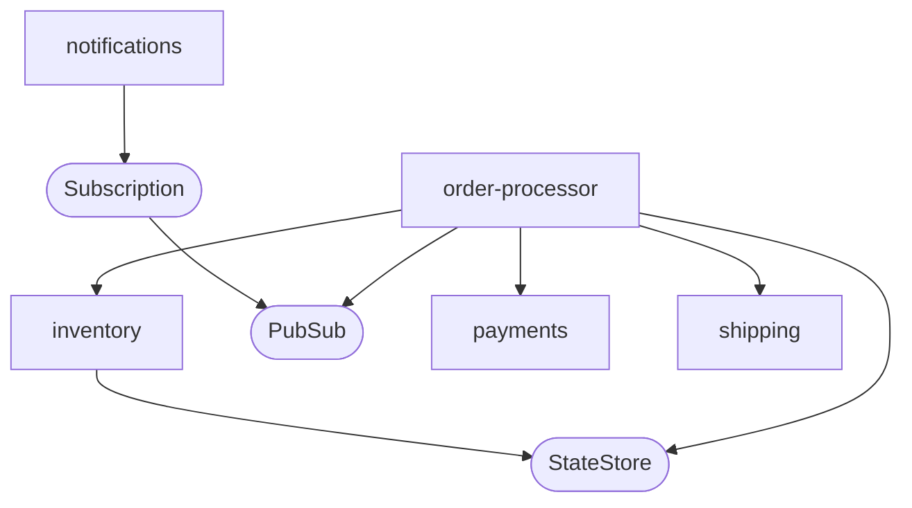

# Dapr order solution

[](https://codespaces.new/kendallroden/kubecon-dapr-score-demo)

This repository was illustrated and demonstrated during our talk at KubeCon EU 2025: [Dapr + Score: Mixing the Perfect Cocktail for an Enhanced Developer Experience](https://sched.co/1txGi) [video](https://youtu.be/-fGztPUuD8k?list=PLj6h78yzYM2MP0QhYFK8HOb8UqgbIkLMc) [presentation](https://static.sched.com/hosted_files/kccnceu2025/41/Dapr%20%2B%20Score%20%40%20KubeCon%20EU%202025.pdf?_gl=1*4edofk*_gcl_au*MTU2NDkwNDM0OC4xNzQ0MzEyMjI0LjE4NjU4NzM2NDQuMTc0NDc1NjY5OS4xNzQ0NzU2NzMx*FPAU*MTU2NDkwNDM0OC4xNzQ0MzEyMjI0).



The end-to-end solution is comprised of five services:

- **order-processor**: Contains the order process workflow definition and all associated activity methods which will be executed as part of the workflow sequence using the Dapr Workflow API.
- **inventory**: Receives direct invocation requests sent by the order-processor using the Invocation API to manage inventory state in Redis or another supported Dapr state store.
- **notifications**: Subscribes to messages published by the order-processor using the Pub/Sub API and subsequently displays those messages through a simple JavaScript user interface.
- **shipping**: Receives direct invocation requests sent by the order-processor using the Invocation API to simulate the scheduling of order shipments.
- **payments**: Receives direct invocation requests sent by the order-processor using the Invocation API to process order payments.

## App prerequisites

The solution is comprised of python services:

- Install [Python3](https://www.python.org/downloads/)
- Install [Dapr CLI](https://docs.dapr.io/getting-started/install-dapr-cli/) Version 1.15 + and [initialize dapr locally](https://docs.dapr.io/getting-started/install-dapr-selfhost/)

## Connect local app using Dapr multi-app run file

```bash
dapr run -f . 
```

## Use the APIs

A `test.rest` file is available at the root of this repository and can be used with the VS Code `Rest Client` extension.
