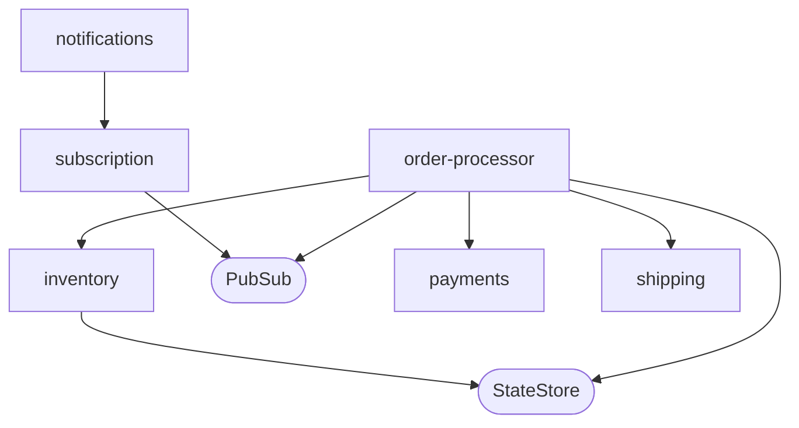
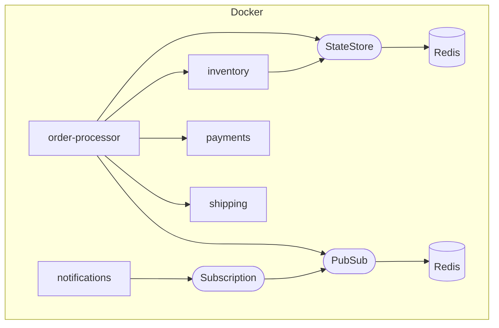
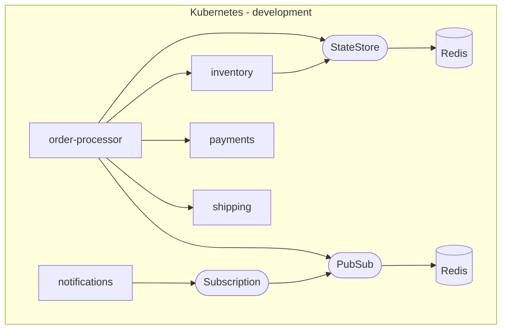
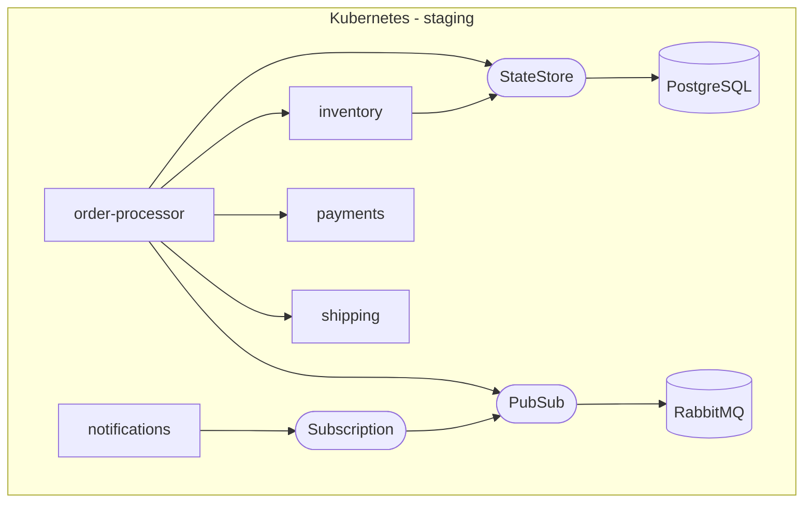
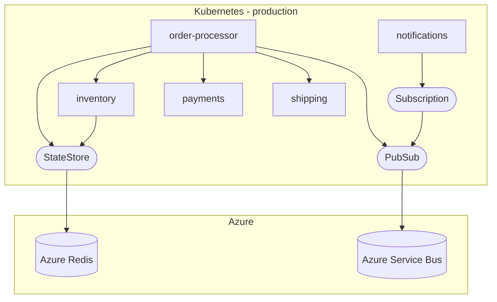

[](https://github.com/codespaces/new/kendallroden/kubecon-dapr-score-demo?hide_repo_select=true&ref=score-setup)



TOC:
- [Deploy locally with `score-compose`](#deploy-locally-with-score-compose)
- [Deploy in Development with `score-k8s`](#deploy-in-development-with-score-k8s)
- [Deploy in Staging with `score-k8s`](#deploy-in-staging-with-score-k8s)
- [Deploy in Production with `score-k8s`](#deploy-in-production-with-score-k8s)

## Deploy locally with `score-compose`



Deploy the Score files via `score-compose` and Docker Compose:
```bash
make deploy-local
```

Test `inventory`:
```bash
INVENTORY_DNS=$(score-compose resources get-outputs dns.default#inventory.dns --format '{{ .host }}')

curl -X POST localhost:8080/inventory/restock -H "Host: ${INVENTORY_DNS}"

curl localhost:8080/inventory -H "Host: ${INVENTORY_DNS}"
```

Test `notifications`:
```bash
NOTIFICATIONS_DNS=$(score-compose resources get-outputs dns.default#notifications.dns --format '{{ .host }}')

echo -e "http://${NOTIFICATIONS_DNS}:8080"
```

Test `order`:
```bash
ORDER_DNS=$(score-compose resources get-outputs dns.default#order-processor.dns --format '{{ .host }}')

curl -X POST localhost:8080/orders -H "Host: ${ORDER_DNS}" -H "Content-Type: application/json" -d '{"id": "test", "customer": "bob", "item": "orange", "total": 12.00}'

curl localhost:8080/orders/FIXME -H "Host: ${ORDER_DNS}"
```

<details><summary>Details</summary>

```bash
docker ps
```

```none
CONTAINER ID   IMAGE                                                     COMMAND                  CREATED        STATUS       PORTS                                              NAMES
c063ca6d4e62   daprio/daprd:latest                                       "./daprd --app-id=or…"   2 hours ago    Up 2 hours                                                      kubecon-dapr-score-demo-order-processor-order-processor-sidecar-1
5cc66364955c   daprio/daprd:latest                                       "./daprd --app-id=in…"   2 hours ago    Up 2 hours                                                      kubecon-dapr-score-demo-inventory-inventory-sidecar-1
e2d9e1dba787   kubecon-dapr-score-demo-order-processor-order-processor   "python app.py"          2 hours ago    Up 2 hours   3000/tcp                                           kubecon-dapr-score-demo-order-processor-order-processor-1
064a699162c2   kubecon-dapr-score-demo-inventory-inventory               "python app.py"          2 hours ago    Up 2 hours   3002/tcp                                           kubecon-dapr-score-demo-inventory-inventory-1
24eddeb9c813   redis:7-alpine                                            "redis-server /usr/l…"   2 hours ago    Up 2 hours   6379/tcp                                           kubecon-dapr-score-demo-redis-UwZoaF-1
7c6240d8e00c   redis:7-alpine                                            "redis-server /usr/l…"   2 hours ago    Up 2 hours   6379/tcp                                           kubecon-dapr-score-demo-redis-MsBXMw-1
361f44246faa   nginx:1-alpine                                            "/docker-entrypoint.…"   2 hours ago    Up 2 hours   0.0.0.0:8080->80/tcp, [::]:8080->80/tcp            kubecon-dapr-score-demo-routing-0uezpt-1
47274726ee14   daprio/daprd:latest                                       "./daprd --app-id=sh…"   2 hours ago    Up 2 hours                                                      kubecon-dapr-score-demo-shipping-shipping-sidecar-1
873eed071832   daprio/daprd:latest                                       "./daprd --app-id=no…"   2 hours ago    Up 2 hours                                                      kubecon-dapr-score-demo-notifications-notifications-sidecar-1
f4bfcc6ede66   daprio/daprd:latest                                       "./daprd --app-id=pa…"   2 hours ago    Up 2 hours                                                      kubecon-dapr-score-demo-payments-payments-sidecar-1
ec2595db1884   kubecon-dapr-score-demo-payments-payments                 "python app.py"          2 hours ago    Up 2 hours   3003/tcp                                           kubecon-dapr-score-demo-payments-payments-1
2b3f9a343bb3   kubecon-dapr-score-demo-notifications-notifications       "python app.py"          2 hours ago    Up 2 hours   3001/tcp                                           kubecon-dapr-score-demo-notifications-notifications-1
56288f9cd74d   kubecon-dapr-score-demo-shipping-shipping                 "python app.py"          2 hours ago    Up 2 hours   3004/tcp                                           kubecon-dapr-score-demo-shipping-shipping-1
4fa771709e94   daprio/dapr                                               "./placement --port …"   2 hours ago    Up 2 hours   0.0.0.0:50006->50006/tcp, :::50006->50006/tcp      kubecon-dapr-score-demo-placement-1
```

```bash
score-compose resources list
```

```none
+------------------------------------------------------+-------------+
|                         UID                          |   OUTPUTS   |
+------------------------------------------------------+-------------+
| dapr-pubsub#pubsub                                   | name        |
+------------------------------------------------------+-------------+
| dapr-state-store#inventory.inventory-state           | name        |
+------------------------------------------------------+-------------+
| dns#inventory.dns                                    | host        |
+------------------------------------------------------+-------------+
| dns#notifications.dns                                | host        |
+------------------------------------------------------+-------------+
| dns#order-processor.dns                              | host        |
+------------------------------------------------------+-------------+
| dapr-subscription#notifications.subscription         | name, topic |
+------------------------------------------------------+-------------+
```

</details>

## Deploy in Development with `score-k8s`

<details><summary>Prerequisites</summary>

If you don't have a Kubernetes cluster that you have access too, you can create a Kind cluster like this:
```bash
make kind-create-cluster
make kind-load-image
```

</details>



Deploy the Score files via `score-k8s` in the `development` Namespace:
```bash
make deploy-development
```

Test `inventory`:
```bash
cd development

INVENTORY_DNS=$(score-k8s resources get-outputs dns.default#inventory.dns --format '{{ .host }}')

curl -X POST localhost:80/inventory/restock -H "Host: ${INVENTORY_DNS}"

curl localhost:80/inventory -H "Host: ${INVENTORY_DNS}"
```

Test `notifications`:
```bash
NOTIFICATIONS_DNS=$(score-k8s resources get-outputs dns.default#notifications.dns --format '{{ .host }}')

echo -e "http://${NOTIFICATIONS_DNS}:80"
```

Test `order`:
```bash
ORDER_DNS=$(score-k8s resources get-outputs dns.default#order-processor.dns --format '{{ .host }}')

<<<<<<< Updated upstream
curl -X POST localhost:80/orders -H "Host: ${ORDER_DNS}" -H "Content-Type: application/json" -d '{"id": "test", "customer": "bob", "items": ["orange"], "total": 12.00}'
=======
curl -X POST ${ORDER_DNS}/orders -H "Content-Type: application/json" -d '{"id": "test", "customer": "bob", "item": ["oranges"], "total": 12.00}'
>>>>>>> Stashed changes

curl localhost:80/orders/FIXME -H "Host: ${ORDER_DNS}"
```

<details><summary>Details</summary>

```bash
kubectl get all -n development
```

```none
NAME                                   READY   STATUS    RESTARTS      AGE
pod/inventory-6dcf6f4d96-ss2fd         2/2     Running   4 (38m ago)   10h
pod/notifications-5d6c4d589b-n8xjh     2/2     Running   4 (38m ago)   10h
pod/order-processor-5b68654df8-8c5dq   2/2     Running   4 (38m ago)   10h
pod/payments-757d6dc5c5-w5sq9          2/2     Running   4 (38m ago)   10h
pod/redis-inventory-1c8b79ab-0         1/1     Running   1 (39m ago)   10h
pod/redis-notifications-fbae7e51-0     1/1     Running   1 (39m ago)   10h
pod/shipping-8cbf999fd-hxcj7           2/2     Running   4 (38m ago)   10h

NAME                           TYPE        CLUSTER-IP      EXTERNAL-IP   PORT(S)                               AGE
inventory                      ClusterIP   10.96.214.89    <none>        3002/TCP                              18m
inventory-dapr                 ClusterIP   None            <none>        80/TCP,50001/TCP,50002/TCP,9090/TCP   18m
notifications                  ClusterIP   10.96.215.105   <none>        3001/TCP                              21m
notifications-dapr             ClusterIP   None            <none>        80/TCP,50001/TCP,50002/TCP,9090/TCP   21m
order-processor                ClusterIP   10.96.62.135    <none>        3000/TCP                              21m
order-processor-dapr           ClusterIP   None            <none>        80/TCP,50001/TCP,50002/TCP,9090/TCP   21m
payments-dapr                  ClusterIP   None            <none>        80/TCP,50001/TCP,50002/TCP,9090/TCP   21m
redis-inventory-184c1761       ClusterIP   10.96.172.252   <none>        6379/TCP                              21m
redis-inventory-7e0c95bd       ClusterIP   10.96.100.248   <none>        6379/TCP                              18m
redis-notifications-1807dd7b   ClusterIP   10.96.250.63    <none>        6379/TCP                              21m
shipping-dapr                  ClusterIP   None            <none>        80/TCP,50001/TCP,50002/TCP,9090/TCP   21m

NAME                              READY   UP-TO-DATE   AVAILABLE   AGE
deployment.apps/inventory         1/1     1            1           10h
deployment.apps/notifications     1/1     1            1           10h
deployment.apps/order-processor   1/1     1            1           10h
deployment.apps/payments          1/1     1            1           10h
deployment.apps/shipping          1/1     1            1           10h

NAME                                         DESIRED   CURRENT   READY   AGE
replicaset.apps/inventory-6dcf6f4d96         1         1         1       10h
replicaset.apps/notifications-5d6c4d589b     1         1         1       10h
replicaset.apps/order-processor-5b68654df8   1         1         1       10h
replicaset.apps/payments-757d6dc5c5          1         1         1       10h
replicaset.apps/shipping-8cbf999fd           1         1         1       10h

NAME                                            READY   AGE
statefulset.apps/redis-inventory-1c8b79ab       1/1     10h
statefulset.apps/redis-notifications-fbae7e51   1/1     10h
```

```bash
score-k8s resources list
```

```none
+------------------------------------------------------+-------------+
|                         UID                          |   OUTPUTS   |
+------------------------------------------------------+-------------+
| dapr-pubsub#pubsub                                   | name        |
+------------------------------------------------------+-------------+
| dapr-state-store#inventory.inventory-state           | name        |
+------------------------------------------------------+-------------+
| dns#inventory.dns                                    | host        |
+------------------------------------------------------+-------------+
| dns#notifications.dns                                | host        |
+------------------------------------------------------+-------------+
| dns#order-processor.dns                              | host        |
+------------------------------------------------------+-------------+
| dapr-subscription#notifications.subscription         | name, topic |
+------------------------------------------------------+-------------+
```

</details>

## Deploy in Staging with `score-k8s`

<details><summary>Prerequisites</summary>

If you don't have a Kubernetes cluster that you have access too, you can create a Kind cluster like this:
```bash
make kind-create-cluster
make kind-load-image
```

</details>



Deploy the Score files via `score-k8s` in the `staging` Namespace:
```bash
make deploy-staging
```

Test `inventory`:
```bash
cd staging

INVENTORY_DNS=$(score-k8s resources get-outputs dns.default#inventory.dns --format '{{ .host }}')

curl -X POST localhost:80/inventory/restock -H "Host: ${INVENTORY_DNS}"

curl localhost:80/inventory -H "Host: ${INVENTORY_DNS}"
```

Test `notifications`:
```bash
NOTIFICATIONS_DNS=$(score-k8s resources get-outputs dns.default#notifications.dns --format '{{ .host }}')

echo -e "http://${NOTIFICATIONS_DNS}:80"
```

Test `order`:
```bash
ORDER_DNS=$(score-k8s resources get-outputs dns.default#order-processor.dns --format '{{ .host }}')

<<<<<<< Updated upstream
curl -X POST localhost:80/orders -H "Host: ${ORDER_DNS}" -H "Content-Type: application/json" -d '{"id": "test", "customer": "bob", "items": ["orange"], "total": 12.00}'
=======
curl -X POST ${ORDER_DNS}/orders -H "Content-Type: application/json" -d '{"id": "test", "customer": "bob", "item": ["oranges"], "total": 12.00}'
>>>>>>> Stashed changes

curl localhost:80/orders/FIXME -H "Host: ${ORDER_DNS}"
```

<details><summary>Details</summary>

```bash
kubectl get all -n staging
```

```none
NAME                                    READY   STATUS    RESTARTS        AGE
pod/inventory-7d7bfd7859-5xk88          2/2     Running   3 (4m42s ago)   5m10s
pod/notifications-bffc9b98b-4whsf       2/2     Running   3 (4m45s ago)   5m9s
pod/order-processor-7585f97f49-tl6ch    2/2     Running   3 (4m42s ago)   5m9s
pod/payments-554d98b4d9-5hz96           2/2     Running   3 (4m42s ago)   5m9s
pod/pg-inventory-83607e1d-0             1/1     Running   0               5m10s
pod/rabbitmq-notifications-6bd2d88e-0   1/1     Running   0               5m10s
pod/shipping-7c4f956bdf-pszr5           2/2     Running   3 (4m42s ago)   5m9s

NAME                                      TYPE        CLUSTER-IP      EXTERNAL-IP   PORT(S)                               AGE
service/inventory                         ClusterIP   10.96.182.146   <none>        3002/TCP                              5m10s
service/inventory-dapr                    ClusterIP   None            <none>        80/TCP,50001/TCP,50002/TCP,9090/TCP   5m10s
service/notifications                     ClusterIP   10.96.185.83    <none>        3001/TCP                              5m10s
service/notifications-dapr                ClusterIP   None            <none>        80/TCP,50001/TCP,50002/TCP,9090/TCP   5m10s
service/order-processor                   ClusterIP   10.96.144.49    <none>        3000/TCP                              5m10s
service/order-processor-dapr              ClusterIP   None            <none>        80/TCP,50001/TCP,50002/TCP,9090/TCP   5m10s
service/payments-dapr                     ClusterIP   None            <none>        80/TCP,50001/TCP,50002/TCP,9090/TCP   5m9s
service/pg-inventory-83607e1d             ClusterIP   10.96.137.104   <none>        5432/TCP                              5m10s
service/rabbitmq-notifications-6bd2d88e   ClusterIP   10.96.103.227   <none>        5672/TCP,15672/TCP                    5m10s
service/shipping-dapr                     ClusterIP   None            <none>        80/TCP,50001/TCP,50002/TCP,9090/TCP   5m9s

NAME                              READY   UP-TO-DATE   AVAILABLE   AGE
deployment.apps/inventory         1/1     1            1           5m10s
deployment.apps/notifications     1/1     1            1           5m10s
deployment.apps/order-processor   1/1     1            1           5m10s
deployment.apps/payments          1/1     1            1           5m9s
deployment.apps/shipping          1/1     1            1           5m9s

NAME                                         DESIRED   CURRENT   READY   AGE
replicaset.apps/inventory-7d7bfd7859         1         1         1       5m10s
replicaset.apps/notifications-bffc9b98b      1         1         1       5m10s
replicaset.apps/order-processor-7585f97f49   1         1         1       5m10s
replicaset.apps/payments-554d98b4d9          1         1         1       5m9s
replicaset.apps/shipping-7c4f956bdf          1         1         1       5m9s

NAME                                               READY   AGE
statefulset.apps/pg-inventory-83607e1d             1/1     5m10s
statefulset.apps/rabbitmq-notifications-6bd2d88e   1/1     5m10s
```

```bash
score-k8s resources list
```

```none
+------------------------------------------------------+-------------+
|                         UID                          |   OUTPUTS   |
+------------------------------------------------------+-------------+
| dapr-pubsub#pubsub                                   | name        |
+------------------------------------------------------+-------------+
| dapr-state-store#inventory.inventory-state           | name        |
+------------------------------------------------------+-------------+
| dns#inventory.dns                                    | host        |
+------------------------------------------------------+-------------+
| dns#notifications.dns                                | host        |
+------------------------------------------------------+-------------+
| dns#order-processor.dns                              | host        |
+------------------------------------------------------+-------------+
| dapr-subscription#notifications.subscription         | name, topic |
+------------------------------------------------------+-------------+
```

</details>

## Deploy in Production with `score-k8s`

<details><summary>Prerequisites</summary>

If you don't have a Kubernetes cluster that you have access too, you can create a Kind cluster like this:
```bash
make kind-create-cluster
make kind-load-image
```

</details>



Deploy the Score files via `score-k8s` in the `production` Namespace:
```bash
make deploy-production
```

Test `inventory`:
```bash
cd production

INVENTORY_DNS=$(score-k8s resources get-outputs dns.default#inventory.dns --format '{{ .host }}')

curl -X POST localhost:80/inventory/restock -H "Host: ${INVENTORY_DNS}"

curl localhost:80/inventory -H "Host: ${INVENTORY_DNS}"
```

Test `notifications`:
```bash
NOTIFICATIONS_DNS=$(score-k8s resources get-outputs dns.default#notifications.dns --format '{{ .host }}')

echo -e "http://${NOTIFICATIONS_DNS}:80"
```

Test `order`:
```bash
ORDER_DNS=$(score-k8s resources get-outputs dns.default#order-processor.dns --format '{{ .host }}')

<<<<<<< Updated upstream
curl -X POST localhost:80/orders -H "Host: ${ORDER_DNS}" -H "Content-Type: application/json" -d '{"id": "test", "customer": "bob", "items": ["orange"], "total": 12.00}'
=======
curl -X POST ${ORDER_DNS}/orders -H "Content-Type: application/json" -d '{"id": "test", "customer": "bob", "item": ["oranges"], "total": 12.00}'
>>>>>>> Stashed changes

curl localhost:80/orders/FIXME -H "Host: ${ORDER_DNS}"
```

<details><summary>Details</summary>

```bash
kubectl get all -n production
```

```none
NAME                                   READY   STATUS    RESTARTS      AGE
pod/inventory-556954fbd6-z5m48         2/2     Running   1 (10m ago)   10m
pod/notifications-648b4f9fc-l8z8l      2/2     Running   0             10m
pod/order-processor-5d8bcbcb9c-8tz4n   2/2     Running   1 (10m ago)   10m
pod/payments-5597b56cbc-dmjsc          2/2     Running   1 (10m ago)   10m
pod/redis-notifications-8c65e063-0     1/1     Running   0             10m
pod/shipping-857fb55c79-hgp64          2/2     Running   0             10m

NAME                           TYPE        CLUSTER-IP      EXTERNAL-IP   PORT(S)                               AGE
inventory                      ClusterIP   10.96.214.89    <none>        3002/TCP                              18m
inventory-dapr                 ClusterIP   None            <none>        80/TCP,50001/TCP,50002/TCP,9090/TCP   18m
notifications                  ClusterIP   10.96.215.105   <none>        3001/TCP                              21m
notifications-dapr             ClusterIP   None            <none>        80/TCP,50001/TCP,50002/TCP,9090/TCP   21m
order-processor                ClusterIP   10.96.62.135    <none>        3000/TCP                              21m
order-processor-dapr           ClusterIP   None            <none>        80/TCP,50001/TCP,50002/TCP,9090/TCP   21m
payments-dapr                  ClusterIP   None            <none>        80/TCP,50001/TCP,50002/TCP,9090/TCP   21m
redis-inventory-184c1761       ClusterIP   10.96.172.252   <none>        6379/TCP                              21m
redis-inventory-7e0c95bd       ClusterIP   10.96.100.248   <none>        6379/TCP                              18m
redis-notifications-1807dd7b   ClusterIP   10.96.250.63    <none>        6379/TCP                              21m
shipping-dapr                  ClusterIP   None            <none>        80/TCP,50001/TCP,50002/TCP,9090/TCP   21m

NAME                              READY   UP-TO-DATE   AVAILABLE   AGE
deployment.apps/inventory         1/1     1            1           10m
deployment.apps/notifications     1/1     1            1           10m
deployment.apps/order-processor   1/1     1            1           10m
deployment.apps/payments          1/1     1            1           10m
deployment.apps/shipping          1/1     1            1           10m

NAME                                         DESIRED   CURRENT   READY   AGE
replicaset.apps/inventory-556954fbd6         1         1         1       10m
replicaset.apps/notifications-648b4f9fc      1         1         1       10m
replicaset.apps/order-processor-5d8bcbcb9c   1         1         1       10m
replicaset.apps/payments-5597b56cbc          1         1         1       10m
replicaset.apps/shipping-857fb55c79          1         1         1       10m

NAME                                            READY   AGE
statefulset.apps/redis-notifications-8c65e063   1/1     10m
```

```bash
score-k8s resources list
```

```none
+------------------------------------------------------+-------------+
|                         UID                          |   OUTPUTS   |
+------------------------------------------------------+-------------+
| dapr-pubsub#pubsub                                   | name        |
+------------------------------------------------------+-------------+
| dapr-state-store#inventory.inventory-state           | name        |
+------------------------------------------------------+-------------+
| dns#inventory.dns                                    | host        |
+------------------------------------------------------+-------------+
| dns#notifications.dns                                | host        |
+------------------------------------------------------+-------------+
| dns#order-processor.dns                              | host        |
+------------------------------------------------------+-------------+
| dapr-subscription#notifications.subscription         | name, topic |
+------------------------------------------------------+-------------+
```

</details>
