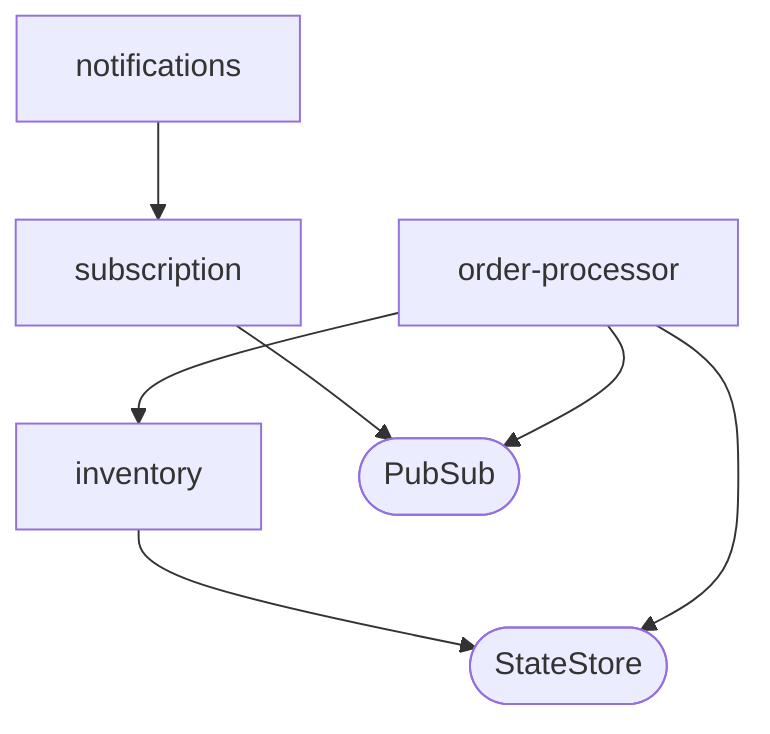
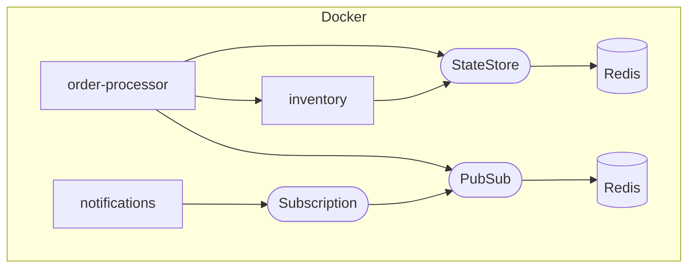
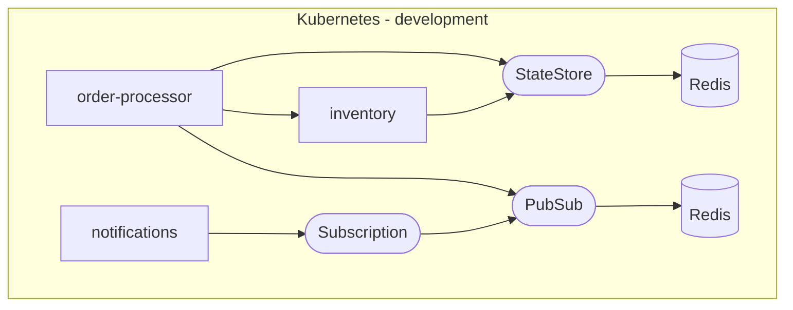
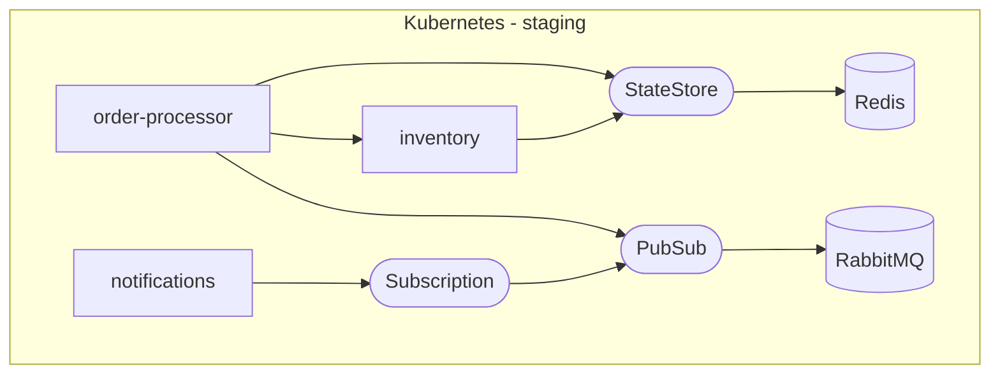
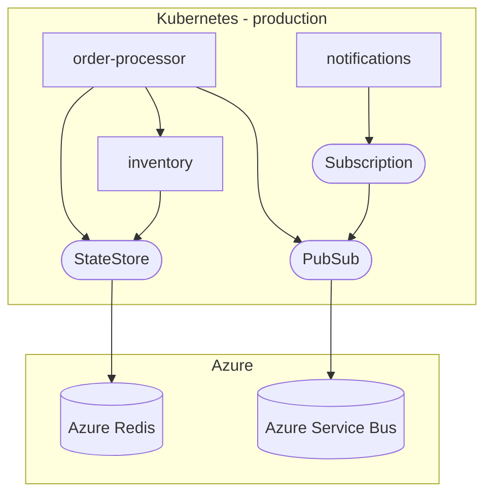

[](https://github.com/codespaces/new/kendallroden/kubecon-dapr-score-demo?hide_repo_select=true&ref=score-setup)



## Deploy locally with `score-compose`



```bash
make compose-up
```

Test `inventory`:
```bash
curl -X POST $(score-compose resources get-outputs dns.default#inventory.dns --format '{{ .host }}:8080/inventory/restock')

curl $(score-compose resources get-outputs dns.default#inventory.dns --format '{{ .host }}:8080/inventory')
```

<details><summary>Details</summary>

```bash
docker ps
```

```none
CONTAINER ID   IMAGE                                                     COMMAND                  CREATED          STATUS          PORTS                                              NAMES
1e66310246ae   kubecon-dapr-score-demo-shipping-shipping                 "python app.py"          45 seconds ago   Up 41 seconds   3004/tcp                                           kubecon-dapr-score-demo-shipping-shipping-1
bc1a25146843   kubecon-dapr-score-demo-payments-payments                 "python app.py"          45 seconds ago   Up 42 seconds   3003/tcp                                           kubecon-dapr-score-demo-payments-payments-1
85d575604017   kubecon-dapr-score-demo-inventory-inventory               "python app.py"          45 seconds ago   Up 42 seconds   3002/tcp                                           kubecon-dapr-score-demo-inventory-inventory-1
eeab45d7fc92   kubecon-dapr-score-demo-order-processor-order-processor   "python app.py"          45 seconds ago   Up 42 seconds   3000/tcp                                           kubecon-dapr-score-demo-order-processor-order-processor-1
0bd899f888ae   kubecon-dapr-score-demo-notifications-notifications       "python app.py"          45 seconds ago   Up 41 seconds   3001/tcp                                           kubecon-dapr-score-demo-notifications-notifications-1
866b9a6b6a44   redis:7-alpine                                            "redis-server /usr/l…"   45 seconds ago   Up 44 seconds   6379/tcp                                           kubecon-dapr-score-demo-redis-ToRXZ1-1
e60e7eb1728a   redis:7-alpine                                            "redis-server /usr/l…"   45 seconds ago   Up 44 seconds   6379/tcp                                           kubecon-dapr-score-demo-redis-utwSSY-1
c3ffeaa9a533   nginx:1-alpine                                            "/docker-entrypoint.…"   45 seconds ago   Up 44 seconds   0.0.0.0:8080->80/tcp, [::]:8080->80/tcp            kubecon-dapr-score-demo-routing-J5Pfg8-1
5b7c3eb44983   daprio/dapr                                               "./placement -port 5…"   45 seconds ago   Up 44 seconds   0.0.0.0:50006->50006/tcp, :::50006->50006/tcp      kubecon-dapr-score-demo-placement-1
```

```bash
score-compose resources list
```

```none
+------------------------------------------------------+-------------+
|                         UID                          |   OUTPUTS   |
+------------------------------------------------------+-------------+
| dapr-pubsub.default#pubsub                           | name        |
+------------------------------------------------------+-------------+
| dapr-state-store.default#inventory.inventory-state   | name        |
+------------------------------------------------------+-------------+
| dns.default#inventory.dns                            | host        |
+------------------------------------------------------+-------------+
| dapr-subscription.default#notifications.subscription | name, topic |
+------------------------------------------------------+-------------+
| route.default#inventory.route                        |             |
+------------------------------------------------------+-------------+
```

</details>

## Deploy in Development with `score-k8s`

<details><summary>Prerequisites</summary>

If you don't have a Kubernetes cluster that you have access too, you can create a Kind cluster like this:
```bash
make kind-create-cluster
make kind-load-image
```

</details>



```bash
make k8s-up
```

Test `inventory`:
```bash
curl -X POST $(score-k8s resources get-outputs dns.default#inventory.dns --format '{{ .host }}/inventory/restock')

curl $(score-k8s resources get-outputs dns.default#inventory.dns --format '{{ .host }}/inventory')
```

<details><summary>Details</summary>

```bash
kubectl get all
```

```none
NAME                                   READY   STATUS    RESTARTS      AGE
pod/inventory-6dcf6f4d96-ss2fd         2/2     Running   4 (38m ago)   10h
pod/notifications-5d6c4d589b-n8xjh     2/2     Running   4 (38m ago)   10h
pod/order-processor-5b68654df8-8c5dq   2/2     Running   4 (38m ago)   10h
pod/payments-757d6dc5c5-w5sq9          2/2     Running   4 (38m ago)   10h
pod/redis-inventory-1c8b79ab-0         1/1     Running   1 (39m ago)   10h
pod/redis-notifications-fbae7e51-0     1/1     Running   1 (39m ago)   10h
pod/shipping-8cbf999fd-hxcj7           2/2     Running   4 (38m ago)   10h

NAME                                   TYPE        CLUSTER-IP      EXTERNAL-IP   PORT(S)                               AGE
service/inventory                      ClusterIP   10.96.182.178   <none>        3002/TCP                              10h
service/inventory-dapr                 ClusterIP   None            <none>        80/TCP,50001/TCP,50002/TCP,9090/TCP   10h
service/kubernetes                     ClusterIP   10.96.0.1       <none>        443/TCP                               30h
service/notifications-dapr             ClusterIP   None            <none>        80/TCP,50001/TCP,50002/TCP,9090/TCP   10h
service/order-processor-dapr           ClusterIP   None            <none>        80/TCP,50001/TCP,50002/TCP,9090/TCP   10h
service/payments-dapr                  ClusterIP   None            <none>        80/TCP,50001/TCP,50002/TCP,9090/TCP   10h
service/redis-inventory-1c8b79ab       ClusterIP   10.96.216.157   <none>        6379/TCP                              10h
service/redis-notifications-fbae7e51   ClusterIP   10.96.193.202   <none>        6379/TCP                              10h
service/shipping-dapr                  ClusterIP   None            <none>        80/TCP,50001/TCP,50002/TCP,9090/TCP   10h

NAME                              READY   UP-TO-DATE   AVAILABLE   AGE
deployment.apps/inventory         1/1     1            1           10h
deployment.apps/notifications     1/1     1            1           10h
deployment.apps/order-processor   1/1     1            1           10h
deployment.apps/payments          1/1     1            1           10h
deployment.apps/shipping          1/1     1            1           10h

NAME                                         DESIRED   CURRENT   READY   AGE
replicaset.apps/inventory-6dcf6f4d96         1         1         1       10h
replicaset.apps/notifications-5d6c4d589b     1         1         1       10h
replicaset.apps/order-processor-5b68654df8   1         1         1       10h
replicaset.apps/payments-757d6dc5c5          1         1         1       10h
replicaset.apps/shipping-8cbf999fd           1         1         1       10h

NAME                                            READY   AGE
statefulset.apps/redis-inventory-1c8b79ab       1/1     10h
statefulset.apps/redis-notifications-fbae7e51   1/1     10h
```

```bash
score-k8s resources list
```

```none
+------------------------------------------------------+-------------+
|                         UID                          |   OUTPUTS   |
+------------------------------------------------------+-------------+
| dapr-pubsub.default#pubsub                           | name        |
+------------------------------------------------------+-------------+
| dapr-state-store.default#inventory.inventory-state   | name        |
+------------------------------------------------------+-------------+
| dns.default#inventory.dns                            | host        |
+------------------------------------------------------+-------------+
| dapr-subscription.default#notifications.subscription | name, topic |
+------------------------------------------------------+-------------+
| route.default#inventory.route                        |             |
+------------------------------------------------------+-------------+
```

</details>

## Deploy in Staging with `score-k8s`

<details><summary>Prerequisites</summary>

If you don't have a Kubernetes cluster that you have access too, you can create a Kind cluster like this:
```bash
make kind-create-cluster
make kind-load-image
```

</details>



FIXME

## Deploy in Production with `score-k8s`

<details><summary>Prerequisites</summary>

If you don't have a Kubernetes cluster that you have access too, you can create a Kind cluster like this:
```bash
make kind-create-cluster
make kind-load-image
```

</details>



FIXME