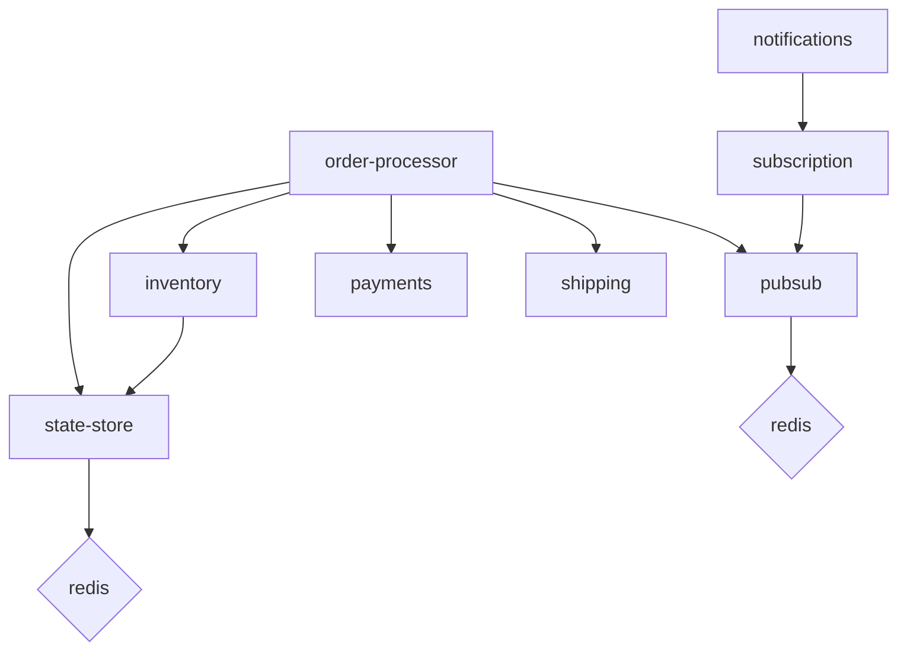

## `score-compose`



```bash
make compose-up
```

```bash
docker ps
```

```none
CONTAINER ID   IMAGE                                                     COMMAND                  CREATED          STATUS          PORTS                                              NAMES
1e66310246ae   kubecon-dapr-score-demo-shipping-shipping                 "python app.py"          45 seconds ago   Up 41 seconds   3004/tcp                                           kubecon-dapr-score-demo-shipping-shipping-1
bc1a25146843   kubecon-dapr-score-demo-payments-payments                 "python app.py"          45 seconds ago   Up 42 seconds   3003/tcp                                           kubecon-dapr-score-demo-payments-payments-1
85d575604017   kubecon-dapr-score-demo-inventory-inventory               "python app.py"          45 seconds ago   Up 42 seconds   3002/tcp                                           kubecon-dapr-score-demo-inventory-inventory-1
eeab45d7fc92   kubecon-dapr-score-demo-order-processor-order-processor   "python app.py"          45 seconds ago   Up 42 seconds   3000/tcp                                           kubecon-dapr-score-demo-order-processor-order-processor-1
0bd899f888ae   kubecon-dapr-score-demo-notifications-notifications       "python app.py"          45 seconds ago   Up 41 seconds   3001/tcp                                           kubecon-dapr-score-demo-notifications-notifications-1
866b9a6b6a44   redis:7-alpine                                            "redis-server /usr/l…"   45 seconds ago   Up 44 seconds   6379/tcp                                           kubecon-dapr-score-demo-redis-ToRXZ1-1
e60e7eb1728a   redis:7-alpine                                            "redis-server /usr/l…"   45 seconds ago   Up 44 seconds   6379/tcp                                           kubecon-dapr-score-demo-redis-utwSSY-1
c3ffeaa9a533   nginx:1-alpine                                            "/docker-entrypoint.…"   45 seconds ago   Up 44 seconds   0.0.0.0:8080->80/tcp, [::]:8080->80/tcp            kubecon-dapr-score-demo-routing-J5Pfg8-1
5b7c3eb44983   daprio/dapr                                               "./placement -port 5…"   45 seconds ago   Up 44 seconds   0.0.0.0:50006->50006/tcp, :::50006->50006/tcp      kubecon-dapr-score-demo-placement-1
```

```bash
make k8s-up
```